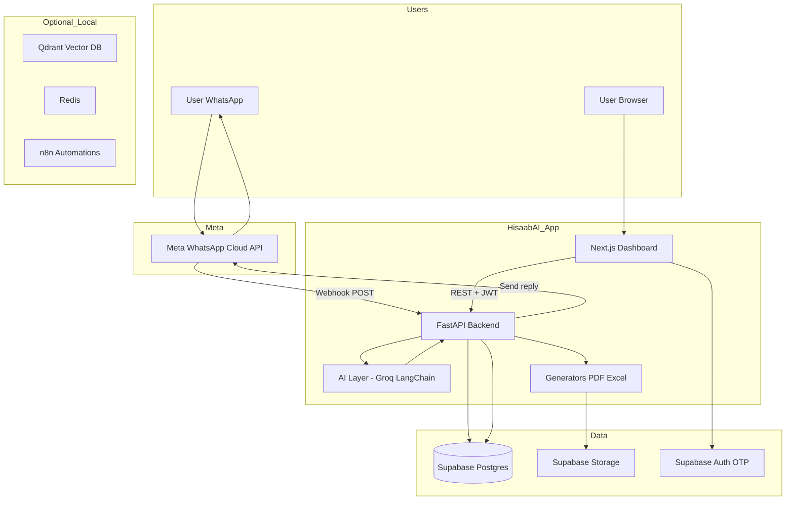
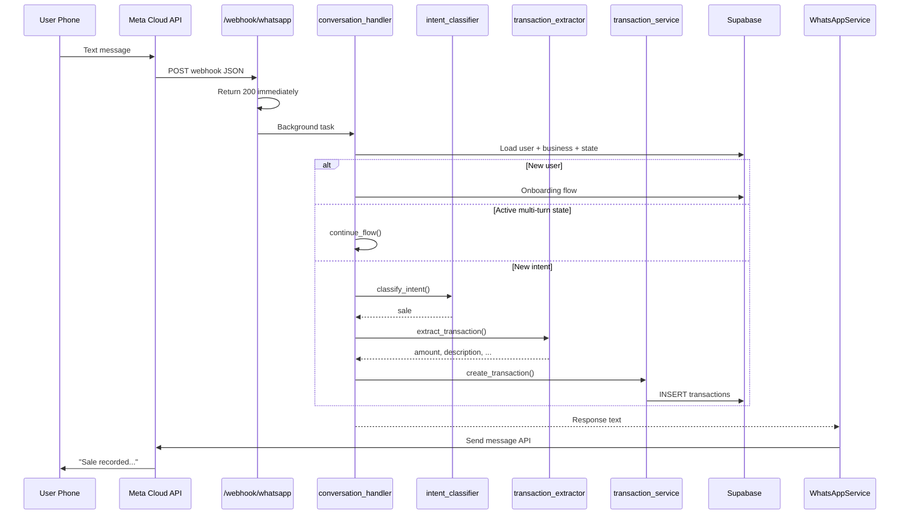
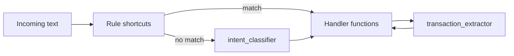
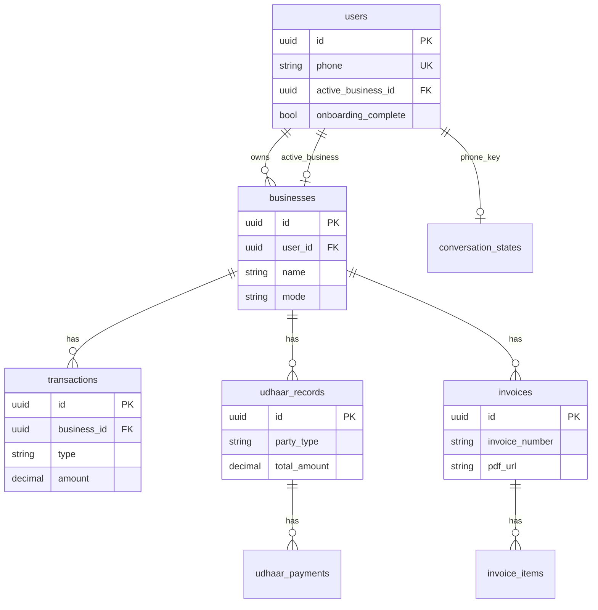
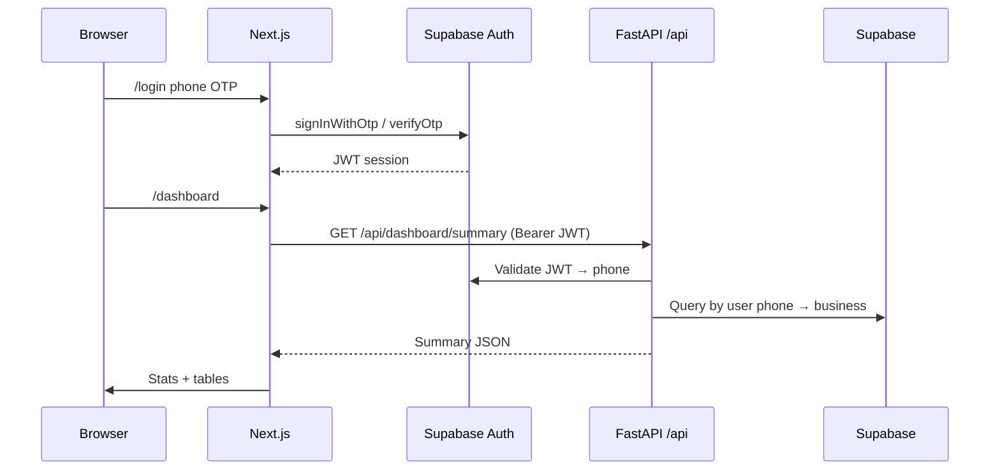

# HisaabAI — System Architecture

This document explains how the application is structured, how data flows end-to-end, and which services talk to each other.

---

## High-level overview

HisaabAI is a **WhatsApp-first** business assistant with a **Next.js dashboard** as the secondary interface. The **FastAPI backend** is the brain: it receives WhatsApp webhooks, runs AI extraction (Groq), and persists data in **Supabase (Postgres + Storage + Auth)**.



---

## Repository layout

```
hisaab-ai/
├── backend/                 # FastAPI application
│   ├── main.py              # App entry, CORS, routers
│   ├── api/                 # HTTP routes
│   │   ├── webhook.py       # WhatsApp verify + receive
│   │   ├── dashboard.py   # Dashboard REST API
│   │   └── health.py
│   ├── core/                # Config, DB client, JWT auth
│   ├── ai/                  # Conversation pipeline + LLM
│   ├── services/            # Business logic
│   ├── generators/          # PDF invoices, Excel reports
│   └── utils/               # Phone, currency, messages
├── frontend/                # Next.js 16 App Router dashboard
├── supabase/schema.sql      # Database tables
├── docker-compose.yml       # Qdrant, Redis, n8n (optional)
└── ARCHITECTURE.md          # This file
```

---

## Message flow (WhatsApp)

When a user sends *"5000 ki sale hui"* on WhatsApp:



### Design choices

| Concern | Implementation |
|--------|----------------|
| Meta 20s timeout | `BackgroundTasks` — webhook returns `{"status":"ok"}` first |
| Multi-turn flows | `conversation_states` table (`state` + `context` JSONB) |
| Urdu / Roman Urdu | Groq LLM prompts + rule-based shortcuts (`menu`, `excel`) |
| Voice / OCR | Optional (`ENABLE_WHISPER`, `ENABLE_OCR`) — off by default for fast dev |

---

## AI pipeline



**Intents:** `sale`, `expense`, `invoice`, `udhaar_*`, `report`, `excel`, `insights`, `help`, `unknown`

**Extractors** return structured JSON: amount, description, customer/vendor, payment method, category.

LangGraph multi-agent graph (Phase 6 in the build guide) is **not required for MVP** — routing is explicit in `conversation_handler.py` for clarity and easier debugging.

---

## Data model (Supabase)



Run `supabase/schema.sql` in the Supabase SQL editor before first use.

Create a **public** storage bucket named `hisaab-files` (or match `SUPABASE_STORAGE_BUCKET`) for PDF/Excel uploads.

---

## Dashboard flow (Next.js)



**Important:** Dashboard API requires the user to complete **WhatsApp onboarding** first (business row + `onboarding_complete = true`). The phone in Supabase Auth must match the WhatsApp `users.phone` row.

---

## API surface

| Endpoint | Auth | Purpose |
|----------|------|---------|
| `GET /health` | None | Liveness |
| `GET /webhook/whatsapp` | Verify token | Meta webhook subscription |
| `POST /webhook/whatsapp` | Optional signature | Receive messages |
| `GET /api/dashboard/summary` | JWT | Overview stats |
| `GET /api/transactions` | JWT | Transaction list |
| `GET /api/udhaar` | JWT | Udhaar ledger |
| `GET /api/invoices` | JWT | Invoice list |
| `GET /api/reports/excel` | JWT | Download `.xlsx` |
| `GET /api/insights` | JWT | Weekly AI insights |
| `GET /api/me` | JWT | User + business profile |

---

## External services

| Service | Role in HisaabAI |
|---------|------------------|
| **Meta WhatsApp Cloud API** | Inbound webhooks + outbound messages/documents |
| **Groq** | Intent classification + transaction extraction + insights |
| **Supabase** | Postgres, Auth (phone OTP), file storage |
| **Resend** | Optional email (configured, not wired in MVP routes) |
| **Qdrant** | Optional semantic memory (`ENABLE_QDRANT_MEMORY`) |
| **Redis / n8n** | Optional cache + scheduled jobs via Docker |

---

## Security model

1. **Webhook:** `WHATSAPP_VERIFY_TOKEN` on GET; optional `X-Hub-Signature-256` when `WHATSAPP_APP_SECRET` is set.
2. **Dashboard API:** Supabase JWT in `Authorization: Bearer`.
3. **Backend DB access:** `SUPABASE_SERVICE_KEY` (server only — never expose to frontend).
4. **Frontend:** Only `NEXT_PUBLIC_SUPABASE_ANON_KEY` + URL.

Enable **Row Level Security** policies in Supabase for production so dashboard users cannot read other tenants' data when using the anon key directly.

---

## Local development (no deploy)

1. Set real `SUPABASE_URL` in `backend/.env` and `frontend/.env.local` (from Supabase → Project Settings → API).
2. Run `supabase/schema.sql` in SQL editor; create storage bucket `hisaab-files`.
3. Backend: `cd backend && source .venv/bin/activate && uvicorn main:app --reload --port 8000`
4. Frontend: `cd frontend && npm run dev` (only when you choose to test UI)
5. WhatsApp: expose backend with ngrok → set Meta webhook to `https://<ngrok>/webhook/whatsapp`, verify token `hisaab_verify_2025`, subscribe to `messages`.

Optional: `docker compose up -d` for Qdrant, Redis, n8n.

---

## What is implemented vs planned

| Feature | Status |
|---------|--------|
| WhatsApp webhook + replies | ✅ |
| Onboarding + menu + NL transactions | ✅ |
| Udhaar, invoices, reports, Excel | ✅ |
| Groq AI intent + extraction | ✅ |
| Next.js dashboard pages | ✅ |
| Whisper / EasyOCR | ⚙️ Optional flags |
| LangGraph agent graph | 📋 Future (Phase 6) |
| n8n scheduled jobs | 📋 Docker only; workflows manual |
| Stripe billing | 📋 Not in MVP |

---

## Mental model (from the build guide)

| Metaphor | Component |
|----------|-----------|
| Kitchen | FastAPI backend |
| Waiters | REST + webhook APIs |
| Customer table | WhatsApp |
| Dining room | Next.js dashboard |
| Recipe book | Groq + prompts |
| Fridge | Supabase |
| Prep cook | n8n (automations) |

This architecture keeps **WhatsApp as the primary UX** while the dashboard provides analytics and exports for power users.
